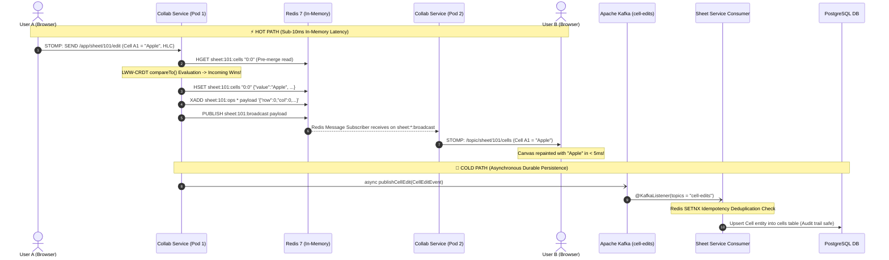
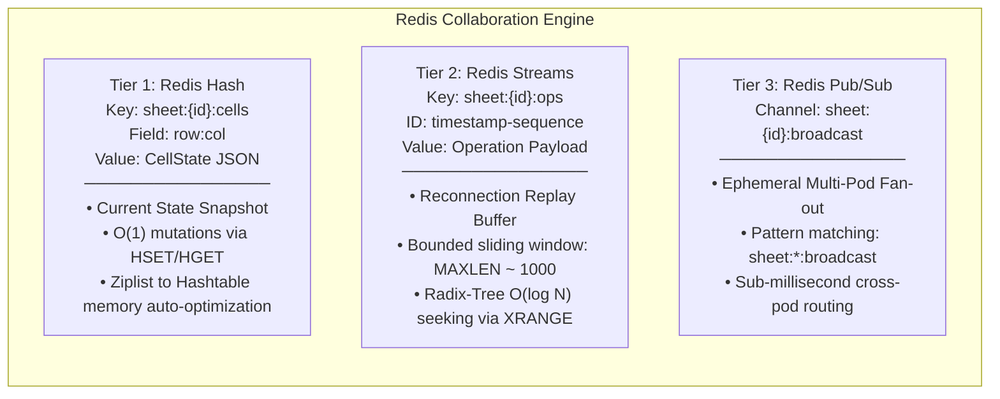
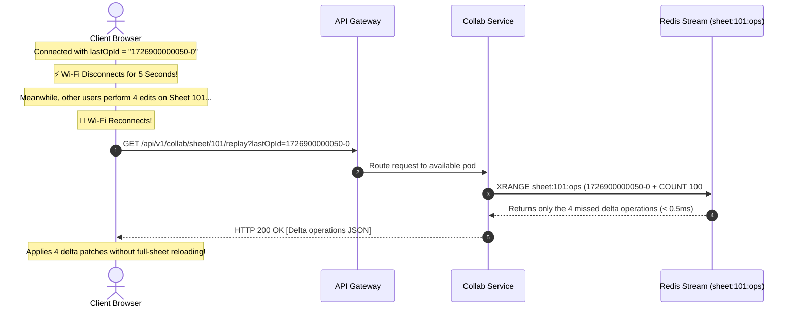
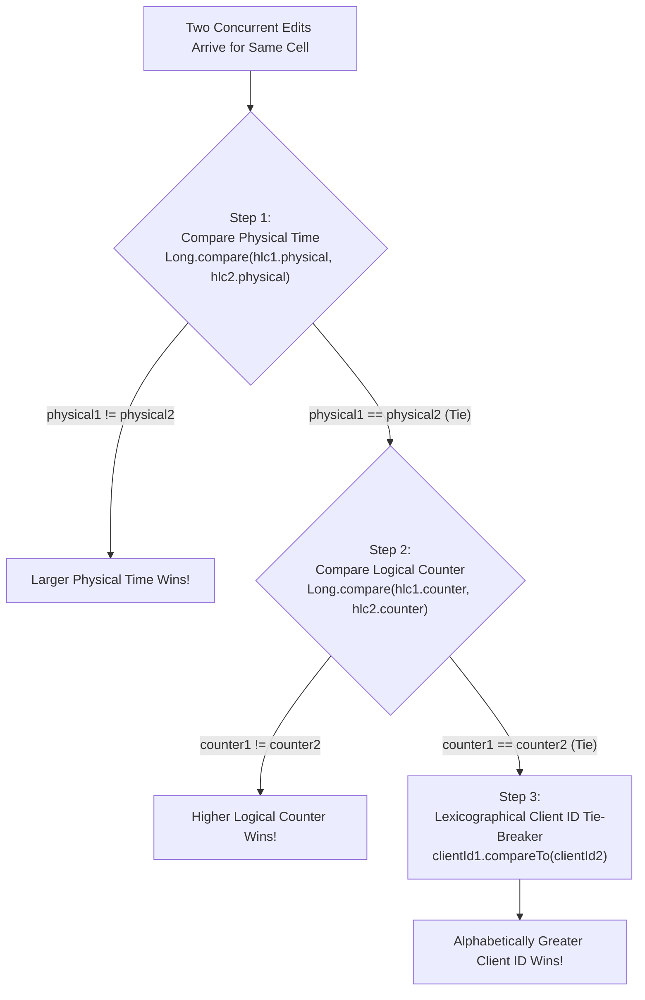
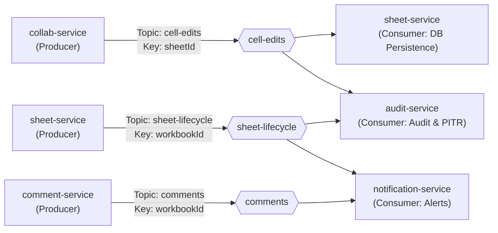

# 🚀 Distributed Real-Time Collaborative Spreadsheet Platform

A production-grade, enterprise-scale real-time collaborative spreadsheet platform (Google Sheets architecture) engineered with **Java 17, Spring Boot 3.2.5, Spring Cloud Microservices, Conflict-Free Replicated Data Types (CRDT), Redis 7 In-Memory Hot Path, Apache Kafka Event Streaming, PostgreSQL, and React 18**.

---

## 📑 Table of Contents
- [System Architecture](#-system-architecture)
- [Core Engineering Highlights](#-core-engineering-highlights)
- [The In-Memory Hot Path vs. Durable Cold Path](#-the-in-memory-hot-path-vs-durable-cold-path)
- [Redis 3-Tier Architecture Deep-Dive](#-redis-3-tier-architecture-deep-dive)
- [CRDT & Hybrid Logical Clock (HLC) Conflict Resolution](#-crdt--hybrid-logical-clock-hlc-conflict-resolution)
- [Microservices Ecosystem](#-microservices-ecosystem)
- [Kafka Event Streaming Backbone](#-kafka-event-streaming-backbone)
- [Security, RBAC & Protected Ranges](#-security-rbac--protected-ranges)
- [Getting Started & Local Setup](#-getting-started--local-setup)
- [Infrastructure as Code (Terraform & Kubernetes)](#-infrastructure-as-code-terraform--kubernetes)
- [API & WebSocket Protocol Reference](#-api--websocket-protocol-reference)

---

## 🏗️ System Architecture

### High-Level Microservices & Network Topology

```mermaid
flowchart TB
    subgraph Clients["Clients Layer"]
        C1["Web Browser (User A)"]
        C2["Web Browser (User B)"]
        C3["Mobile Web (User C)"]
    end

    subgraph Edge["Gateway & Discovery Layer"]
        GW["Spring Cloud API Gateway\n(Port 8080)\n• JWT Authentication\n• Rate Limiting\n• Reverse Proxy Routing"]
        EUR["Netflix Eureka Server\n(Port 8761)\n• Service Registry & Health Checks"]
        CFG["Spring Cloud Config Server\n(Port 8888)\n• Git-Backed Centralized Config"]
    end

    subgraph HotPath["Hot Path (In-Memory Real-Time Cluster)"]
        CS1["Collab Service - Pod 1\n(Port 8083)"]
        CS2["Collab Service - Pod 2\n(Port 8083)"]
        REDIS[("Redis 7 In-Memory Cluster\n───────────────────────\n• Hashes: sheet:{id}:cells (Current State)\n• Streams: sheet:{id}:ops (Replay Buffer)\n• Pub/Sub: sheet:{id}:broadcast (Multi-Pod Bus)")]
    end

    subgraph ColdPath["Cold Path (Durable Event-Driven Microservices)"]
        KAFKA{{"Apache Kafka Event Bus\nTopics: cell-edits, sheet-lifecycle, comments, notifications"}}
        SS["Sheet Service (Port 8082)\n• Workbook / Sheet / Cell CRUD\n• Apache POI Excel Import/Export"]
        US["User Service (Port 8081)\n• Auth, JWT, RBAC"]
        CMS["Comment Service (Port 8084)\n• Cell Comments, Threads, @Mentions"]
        NS["Notification Service (Port 8085)\n• Real-Time User Alerts"]
        AS["Audit Service (Port 8086)\n• Event Sourcing & Point-in-Time Recovery"]
    end

    subgraph Storage["Persistent Relational Storage"]
        PG[("PostgreSQL 15 Instances\n• user_db, sheet_db, comment_db, audit_db")]
    end

    %% Client Connections
    C1 <== "WebSocket (STOMP / WSS)" ==> CS1
    C2 <== "WebSocket (STOMP / WSS)" ==> CS2
    C3 --> "HTTP REST / HTTPS" --> GW

    GW <==> EUR
    CS1 <==> EUR
    CS2 <==> EUR
    SS <==> EUR
    US <==> EUR
    CMS <==> EUR
    NS <==> EUR
    AS <==> EUR

    GW --> CS1
    GW --> CS2
    GW --> SS
    GW --> US
    GW --> CMS
    GW --> AS

    %% Hot Path Interactions
    CS1 <==> REDIS
    CS2 <==> REDIS

    %% Cold Path Streaming
    CS1 -. "Async Event (CellEditEvent)" .-> KAFKA
    CS2 -. "Async Event (CellEditEvent)" .-> KAFKA
    SS -.-> KAFKA
    CMS -.-> KAFKA

    KAFKA ==> SS
    KAFKA ==> NS
    KAFKA ==> AS

    %% DB Storage
    SS ==> PG
    US ==> PG
    CMS ==> PG
    AS ==> PG
```

---

## ⚡ Core Engineering Highlights

- **Sub-10ms Keystroke Convergence:** Powered by an in-memory LWW-CRDT engine with Hybrid Logical Clocks (HLC) avoiding distributed write locks.
- **In-Memory CQRS & Event Sourcing:** Strictly separates high-frequency live writes (Redis Streams/Hashes) from durable relational database storage (PostgreSQL).
- **The 5-Second Wi-Fi Replay Buffer:** Clients seamlessly recover missed edits via `XRANGE` on Redis Streams without re-downloading entire 10MB spreadsheet snapshots.
- **Horizontal Multi-Pod Scaling:** Real-time WebSocket sessions scale across independent Kubernetes pods bridged by an ultra-fast Redis Pub/Sub message bus (< 0.5ms).
- **Point-in-Time Recovery (PITR):** Full time-travel capability allows users to audit and restore sheets to any historical millisecond by replaying Kafka audit event logs.
- **Enterprise Defense-in-Depth:** Stateless JWT validation at the API Gateway, fine-grained RBAC (OWNER, EDITOR, COMMENTER, VIEWER), and cell-level protected range enforcement at both WebSocket and REST layers.

---

## 🔄 The In-Memory Hot Path vs. Durable Cold Path

To support millions of collaborative operations without database bottlenecking, our system strictly decouples the **Hot Path (< 10ms)** from the **Cold Path (50-100ms)**:



---

## 💎 Redis 3-Tier Architecture Deep-Dive

Our collaboration engine coordinates three specialized tiers of Redis data structures:



### The 5-Second Wi-Fi Reconnection Flow



---

## 🧮 CRDT & Hybrid Logical Clock (HLC) Conflict Resolution

Distributed concurrent writes are resolved deterministically using an **LWW-Element-Register (Last-Write-Wins)** strategy guided by **Leslie Lamport's Happens-Before ($\rightarrow$) causality** via **Hybrid Logical Clocks (HLC)**:



### The 3 Core Scenarios Handled by HLC:
1. **Blind Concurrent Writes (Clean Clocks):** Both generate local HLC with `counter = 0`. The deterministic 3-step ladder chooses a single global winner across all replicas.
2. **Causal Reactive Writes with Clock Skew:** When User B reads User A's edit (`10:50`) and types a reply on a slow hardware clock (`09:59`), User B's HLC leaps forward to `10:50` and increments `counter = remoteCounter + 1 = 1`. User B strictly overrides User A.
3. **Blind Concurrent Writes with Skew & Self-Healing:** The higher timestamp wins. When the losing client receives the broadcast, its local HLC immediately leaps forward via `Math.max(local, remote)` in `crdt.js`, neutralizing the skew for all subsequent keystrokes.

---

## 🏛️ Microservices Ecosystem

| Microservice | Port | Database / Storage | Key Responsibilities |
| :--- | :---: | :--- | :--- |
| **`eureka-server`** | `8761` | In-Memory Registry | Netflix Eureka service registry, heartbeat monitoring, dynamic instance discovery. |
| **`config-server`** | `8888` | Local / Git Repository | Spring Cloud Config centralized configuration management across profiles (`dev`, `prod`). |
| **`api-gateway`** | `8080` | Redis (Rate Limiter) | Non-blocking Spring Cloud Gateway, JWT verification filter, token claim routing, request rate limiting. |
| **`user-service`** | `8081` | PostgreSQL (`user_db`) | User authentication, BCrypt password hashing, JWT generation/rotation, user profiles. |
| **`sheet-service`** | `8082` | PostgreSQL (`sheet_db`) | Workbook, sheet, and cell CRUD, Apache POI Excel import/export (`.xlsx`, `.csv`), range querying. |
| **`collab-service`** | `8083` | Redis (Hash, Stream, Pub/Sub) | **The Collaboration Core**: WebSocket STOMP handlers, CRDT LWW merge engine, presence tracking, protected range verification. |
| **`comment-service`**| `8084` | PostgreSQL (`comment_db`) | Cell-anchored comments, threaded replies, `@mention` event triggers. |
| **`notification-service`**| `8085` | PostgreSQL / In-Memory | Kafka event listener for comments and sheet shares, in-app notification dispatch. |
| **`audit-service`** | `8086` | PostgreSQL (`audit_db`) | Immutable event sourcing audit ledger, change diffs, Point-in-Time Recovery (PITR) workbook restoration. |
| **`common-lib`** | N/A | Shared Library | Domain entities (`CellState`, `HybridLogicalClock`), shared DTOs, Kafka event definitions. |
| **`frontend`** | `5173` | Browser Virtualized DOM | React 18, Vite, Canvas-based grid, SockJS/Stomp client, client-side CRDT mirror. |

---

## 📡 Kafka Event Streaming Backbone



### Idempotency & Deduplication
Every Kafka event contains a unique `eventId` (UUID). Downstream consumers execute an atomic Redis `SETNX` with a 24-hour TTL:
```java
String dedupeKey = "sheet:dedupe:cell-edit:" + event.getEventId();
Boolean isNew = redisTemplate.opsForValue().setIfAbsent(dedupeKey, "1", Duration.ofHours(24));
if (Boolean.FALSE.equals(isNew)) {
    return; // Duplicate skipped
}
```

---

## 🔐 Security, RBAC & Protected Ranges

1. **Stateless JWT Flow:** Access tokens (15-minute expiry) signed with HMAC-SHA256, alongside rotated refresh tokens (7-day expiry).
2. **Role-Based Access Control (RBAC):**
   * **OWNER:** Full administrative control, sheet deletion, permission delegation.
   * **EDITOR:** Read/write permissions on non-protected cells.
   * **COMMENTER:** Read-only access with commenting and mention privileges.
   * **VIEWER:** Strict read-only access.
3. **Protected Range Engine:**
   * Range rules (`startRow`, `startCol`, `endRow`, `endCol`, `allowedUserIds`) are cached in Redis (`sheet:protected-ranges:{sheetId}`).
   * Validated in **`ProtectedRangeRedisValidator.java`** in $O(1)$ time during the WebSocket STOMP inbound channel interception. Unauthorized edits are rejected before entering the CRDT pipeline.

---

## 🚀 Getting Started & Local Setup

### Prerequisites
* **Java 17 or 21 (LTS)**
* **Maven 3.9+**
* **Docker & Docker Compose**
* **Node.js 18+ & npm**

### 1. Clone & Start Infrastructure
```bash
# Clone the repository
git clone https://github.com/<your-username>/realtime-collaborative-spreadsheet-platform.git
cd realtime-collaborative-spreadsheet-platform

# Spin up PostgreSQL, Redis, and Kafka + Zookeeper
docker-compose up -d
```

### 2. Build All Microservices
```bash
mvn clean install -DskipTests
```

### 3. Launch Services (Order of Initialization)
```bash
# 1. Config Server
cd config-server && mvn spring-boot:run

# 2. Service Discovery (Eureka)
cd eureka-server && mvn spring-boot:run

# 3. Microservices (Open in separate terminal tabs)
cd user-service && mvn spring-boot:run
cd sheet-service && mvn spring-boot:run
cd collab-service && mvn spring-boot:run
cd comment-service && mvn spring-boot:run
cd notification-service && mvn spring-boot:run
cd audit-service && mvn spring-boot:run

# 4. API Gateway (Main Ingress)
cd api-gateway && mvn spring-boot:run
```

### 4. Launch Frontend
```bash
cd frontend
npm install
npm run dev
```
Open **`http://localhost:5173`** in your browser. Open multiple incognito windows to test live concurrent editing!

---

## ☁️ Infrastructure as Code (Terraform & Kubernetes)

The platform is designed for enterprise cloud deployment via **Terraform** (`/terraform`) and **Kubernetes** (`/k8s`):

```bash
# Provision Cloud Infrastructure (AWS VPC, EKS, RDS PostgreSQL, ElastiCache Redis, MSK Kafka)
cd terraform
terraform init
terraform plan
terraform apply

# Deploy Microservices to Kubernetes
kubectl apply -f k8s/
kubectl get pods -w
```

---

## 📚 API & WebSocket Protocol Reference

### WebSocket STOMP Endpoints (`collab-service` :8083)
* **Handshake URL:** `ws://localhost:8080/ws`
* **Inbound Send Destinations:**
  * `/app/sheet/{sheetId}/edit` — Submit a single cell mutation.
  * `/app/sheet/{sheetId}/edit/batch` — Submit atomic multi-cell updates (copy-paste / formula drag).
  * `/app/sheet/{sheetId}/cursor` — Emit live cursor coordinates.
  * `/app/sheet/{sheetId}/presence` — Announce user entrance/heartbeat.
* **Outbound Subscriptions:**
  * `/topic/sheet/{sheetId}/cells` — Receive winning cell CRDT updates.
  * `/topic/sheet/{sheetId}/presence` — Receive live presence & cursor locations.

### Core REST Endpoints (via API Gateway :8080)
* `POST /api/v1/auth/login` — Authenticate and receive JWT tokens.
* `GET  /api/v1/sheets/{sheetId}` — Fetch sheet metadata and layout.
* `GET  /api/v1/collab/sheet/{sheetId}/state` — Fetch current live CRDT cell state snapshot.
* `GET  /api/v1/collab/sheet/{sheetId}/replay?lastOpId=...` — Fetch delta operations after high-water mark.
* `POST /api/v1/sheets/{sheetId}/export/xlsx` — Export sheet as Microsoft Excel workbook.
* `POST /api/v1/audit/workbook/{workbookId}/restore` — Replay audit log and restore sheet to point in time.

---

## 👨‍💻 Author

**Priyanshu Jaiswal**  
Full Stack Java & Distributed Systems Developer  
Specializing in High-Throughput Real-Time Collaboration, Microservices, and Cloud Architectures.

---

## 📄 License
This project is open-source and available under the [MIT License](LICENSE).
